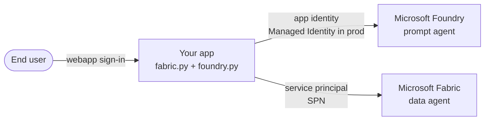

# Fabric Data Agent as a Foundry Tool

## 1. What this repo is

Solves a real access-governance problem for AI apps that combine
**Microsoft Foundry agents** with **Microsoft Fabric data agents**.

**The problem.** An AI app fronted by a Foundry agent often needs to answer
questions grounded in Fabric data. Today (August 2026), there is **no
managed-identity pass-through from a Foundry agent to a Fabric data agent**.
The naive approach — each end user calls the Foundry agent, which calls the
Fabric data agent as that same user — requires **every end user of the app to
have direct Fabric access**. That is impractical for a chat webapp with
hundreds or thousands of users, and it breaks data governance in scenarios
where the end user should not have direct Fabric access at all.

**This pattern.** The **app itself** (the process hosting the Foundry
conversation loop) authenticates to Fabric under a single **service principal
(SPN)** that has been granted Fabric workspace access. End users never touch
Fabric. The app's identity — not the user's — accesses the data.



See [docs/architecture.md](docs/architecture.md) for the detailed component
diagram, credential boundary, and production shape.

- **Foundry side** — called with the app's identity.
  Locally: `DefaultAzureCredential` (developer's `az login`).
  In production: **Managed Identity** of the app service / container.
- **Fabric side** — called with a **service principal (SPN)**, because
  managed-identity pass-through from a Foundry agent to a Fabric data agent
  is not supported today. `ClientSecretCredential` reads the SPN from
  `.env`; in production the secret should come from Key Vault.

End users authenticate at the **app boundary** (your webapp's sign-in). The
app authorizes them for the Foundry conversation. Fabric is called by the
app, not by the user.

This repo is a small standalone demo of the pattern so you can lift the two
files (`fabric.py`, `foundry.py`) into your existing FastAPI chat app.

For deeper detail:

- [docs/architecture.md](docs/architecture.md) — why the pattern exists,
  credential boundary, production shape
- [docs/flow.md](docs/flow.md) — request lifecycle, session and token reuse
- [docs/spn-setup.md](docs/spn-setup.md) — how to register the SPN, enable
  Fabric APIs, and grant workspace + data-source access

## 2. Settings

Copy `.env.example` to `.env` and fill it in:

| Variable | Purpose |
|---|---|
| `PROJECT_ENDPOINT` | Foundry project endpoint |
| `AGENT_NAME` | Foundry prompt-agent name (defaults to `SimpleAgent`) |
| `TENANT_ID` | Entra tenant hosting the Fabric SPN |
| `FABRIC_SPN_CLIENT_ID` | SPN client ID authorized on the Fabric workspace |
| `FABRIC_SPN_CLIENT_SECRET` | SPN client secret |
| `FABRIC_WORKSPACE_ID` | Fabric workspace containing the data agent |
| `FABRIC_DATA_AGENT_ID` | Fabric data agent ID |

Prerequisites:

- An existing Foundry project and prompt agent.
- An existing Fabric workspace and Fabric data agent.
- A service principal that has access to the Fabric workspace and data agent.
  See [docs/spn-setup.md](docs/spn-setup.md) for the step-by-step provisioning
  guide (register SPN → enable Fabric APIs → grant workspace + data-source
  access).
- A local Azure developer identity that has access to the Foundry project
  (`az login` outside this app).

## 3. How to run

```powershell
py -3.13 -m venv .venv3.13
.\.venv3.13\Scripts\Activate.ps1
pip install -e ".[dev]"
Copy-Item .env.example .env
# fill in .env, then:
python -m foundry_fabric_demo
```

Ask a business-data question at the `You:` prompt. Type `end` to exit; the app
deletes the temporary conversation and closes the Fabric MCP session on the way
out.

Offline checks:

```powershell
pytest
```
