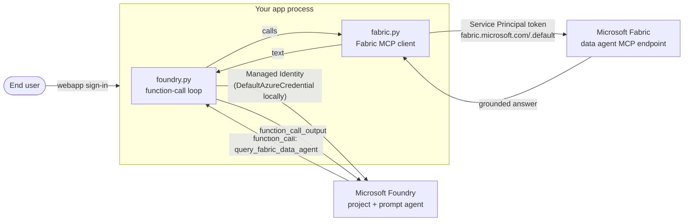

# Architecture

## Why this pattern exists

An AI app fronted by a **Microsoft Foundry agent** often grounds its answers
in **Microsoft Fabric** data. The design choice this repo makes is about
**who** authenticates to Fabric.

If Fabric is called under the end user's identity, every end user of the app
needs direct Fabric access. A chat webapp may have hundreds or thousands of
users; some of them should not have any direct access to the Fabric workspace
at all — they are consumers of grounded answers, not of raw data. That does
not scale, and it breaks data governance.

This repo makes the alternative choice: the **app** authenticates to Fabric
with its own identity, under a service principal (SPN) that has been granted
workspace and data-source access. End users authenticate at the app boundary;
the app calls Fabric on their behalf.

### The pattern

The **app** — not the end user — talks to Fabric. The app authenticates to
Fabric under a **service principal (SPN)** that has been granted Fabric
workspace access.



- **End users** authenticate at the **app boundary** (your webapp's sign-in).
  Authorization to use the Foundry agent is enforced there.
- **The app → Foundry** is either the developer's identity locally
  (`DefaultAzureCredential`) or the app's **Managed Identity** in production.
- **The app → Fabric** is a service principal — one identity, granted access
  to the Fabric workspace and data agent, used for every request regardless
  of which end user asked the question.
- **User identity is never forwarded to Fabric.** The end user has no direct
  Fabric access; the app calls Fabric on their behalf under the SPN.

For the concrete provisioning steps — registering the SPN, enabling Fabric
API access at the tenant, granting the SPN access to the workspace and every
data source — see [spn-setup.md](spn-setup.md).

## Credential boundary — what each side sees

- The Foundry model receives the `query_fabric_data_agent` function schema
  and, later, the string result Fabric returned. It never sees the SPN
  secret, never sees the Fabric MCP URL, never sees the raw Fabric response
  structure.
- The Fabric MCP endpoint receives a bearer token issued to the SPN. It
  never sees the app's Managed Identity, never sees the end user's identity,
  never sees the Foundry conversation ID.
- The app is the only component that holds both sides. Keep the SPN secret
  in Key Vault in production; access it via Managed Identity → Key Vault.

## Production shape (FastAPI web app)

Two touchpoints in your existing chat app:

```python
# app lifespan — one Fabric session per worker
from contextlib import asynccontextmanager
from foundry_fabric_demo.fabric import close_fabric_client

@asynccontextmanager
async def lifespan(app):
    yield
    close_fabric_client()

app = FastAPI(lifespan=lifespan)
```

```python
# inside your existing agent tool-dispatch loop
from foundry_fabric_demo.foundry import execute_function

# when the model emits a query_fabric_data_agent call:
output = execute_function(item.name, item.arguments)
```

Foundry authentication in production: `ManagedIdentityCredential` (or leave
`DefaultAzureCredential`, which resolves to Managed Identity when deployed).
Fabric authentication stays on the SPN — this repo does not assume anything
about future Fabric identity support.

## File layout

```text
src/foundry_fabric_demo/
  fabric.py     Fabric MCP client (SPN + session), tool schema, lazy singleton
  foundry.py    Function-call dispatch, agent version, response loop
  cli.py        Env reads + REPL (local demo only)
  __main__.py   Entry point (python -m foundry_fabric_demo)
tests/
  test_foundry.py
```

The seam that matters for production is `fabric.py` vs `foundry.py` — that's
what you lift into your webapp. `cli.py` is the local demo harness.
