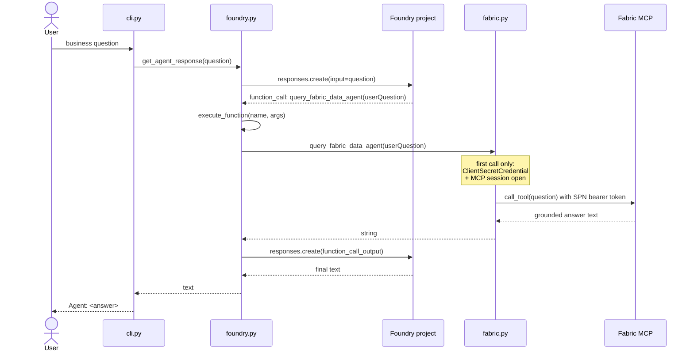

# Request Flow

## What happens on a single user question

## Lazy Fabric activation

The Fabric client is created on the **first tool call**, not at startup:

- If the model answers a question without invoking the tool, no
  `FabricDataAgentClient` is constructed, no SPN token is fetched, and no MCP
  session is opened.
- On the first `query_fabric_data_agent` call, `fabric._client` is initialized,
  a token is acquired, and an MCP session is opened and cached.
- Subsequent tool calls reuse the same session.

Env vars are still validated at startup — `Settings`-style validation isn't
required because `os.environ["..."]` in `FabricDataAgentClient.__init__` fails
loudly on the first tool call if anything is missing. `cli.py` also reads
`PROJECT_ENDPOINT` at startup, which catches half the misconfigurations before
any user turn happens.

## Token and session lifecycle

Inside `fabric.FabricDataAgentClient`:

- **Token refresh** — the cached `AccessToken` is checked before every tool
  call; if it expires within 60 seconds, the session is closed and reopened
  (which forces a new token).
- **Session recovery** — if `session.call_tool(...)` raises, the session is
  closed and reopened once, and the call is retried. If the retry fails, the
  error propagates as `Fabric query failed: ...`.
- **Shutdown** — `close_fabric_client()` (called from `cli.main` `finally`)
  closes the MCP session, stops the background asyncio loop, and closes the
  credential. Safe to call whether or not the tool was ever invoked.

## Agent version publishing

`ensure_agent_has_fabric_tool` runs once at startup:

- Reads the latest version of the target Foundry agent.
- If the registered tool set is exactly `{query_fabric_data_agent}`, does
  nothing.
- Otherwise, publishes a new version with `[FABRIC_DATA_TOOL]` as the tool set,
  preserving the existing model and instructions.

This means the first run may publish a new version; subsequent runs won't. To
change the instructions or model, edit the agent in Foundry Portal (or via
Foundry MCP tools) rather than in this repo — the repo only owns the tool set.
